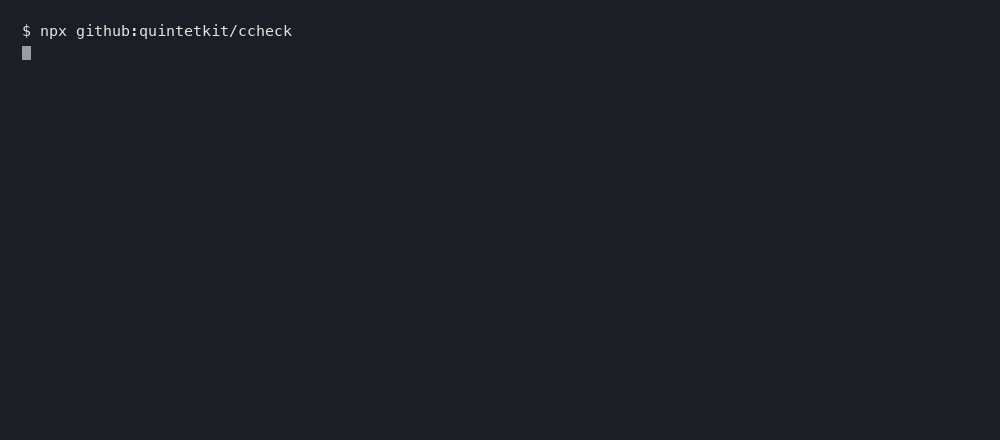

# ccheck

Checks your `.claude/` configuration and tells you what is broken and what has been
deprecated — **with a link to the documentation line that makes it a rule.**

日本語版は [README.ja.md](README.ja.md) にあります。



Claude Code's configuration surface changes week to week. Several sites already
aggregate the changelogs. None of them answer the question you actually have:
**does this change break my config?** That answer is different for every reader,
so it cannot be delivered by an article or a newsletter. It has to be a tool.

## Use it

No dependencies. Node 22 or later.

```bash
npx github:quintetkit/ccheck        # from your repository root
```

In CI:

```yaml
- uses: quintetkit/ccheck@v1
```

## What it checks

| Target | What it looks at |
|---|---|
| `.claude/settings.json` | JSON validity, permission rule syntax, deprecated keys |
| `.claude/agents/*.md` | required frontmatter, duplicate names, invalid names |
| `.mcp.json` | required fields per transport |
| hooks configuration | unknown event names, matchers that match nothing |

## What it will not check

A checker that calls a valid configuration broken is worse than no checker.
So ccheck only implements rules the documentation states outright — as an error,
as skipped, or as ignored. Everything else is passed in silence.

| Not checked | Why |
|---|---|
| Unknown keys | The docs say the published schema lags the CLI. Checking this would flag every new feature |
| `model` values | No exhaustive list of valid values is documented |
| `Read` / `Edit` path patterns | Four anchor forms combined with gitignore semantics — too easy to get wrong |
| Booleans limited to `true` / `false` | `yes` / `no` / `on` / `off` / `1` / `0` are also valid |

Every finding carries the URL it came from, so you can check the original yourself
rather than taking the tool's word for it.

## Sources

`docs-snapshot/` holds the official documentation this was built from, captured
2026-09-04. Before adding a rule, find the line in there that supports it.
**If the documentation does not say it is an error, skipped, or ignored, it does
not become a rule.**

## Exit codes

`1` if there is at least one error, `0` otherwise. Pass `--strict` to fail on
warnings too.

## Related

`ccheck` looks at the shape of a `.claude/` directory. If you are also deciding
what should go *in* one — how to split work so several Claude Code sessions can
run at once without colliding — I publish that as
[Quartet](https://github.com/quintetkit/quartet): four personas with separate
permissions, driven by GitHub Issues, under MIT.

A larger version with a UI Designer persona, the Reviewer's decision criteria,
a per-Issue parallel execution script and a 10-chapter guide is
[sold as Quintet](https://quartet-dev.booth.pm/items/8807156).

## Licence

MIT
